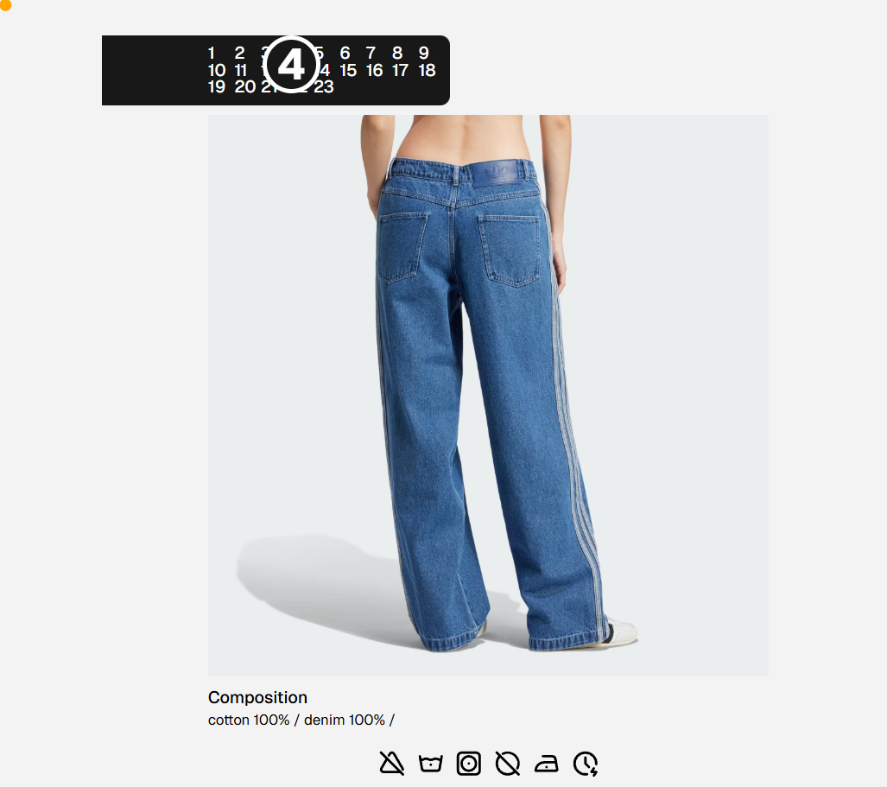

# 👗 Ropero

A simple app to help you take care of your clothes.

> Backend API: [https://github.com/brandonporcel/ropero-backend](https://github.com/brandonporcel/ropero-backend)



## Install

```bash
git clone https://github.com/brandonporcel/ropero.git
cd ropero
npm install
npm run dev
```

## To-Do

- [ ] Carousel of images
- [ ] Improve ux
- [ ] Add login and manage personal wardrobe
- [ ] Make washing machine unique for each user

---

## Contributing

Contributions are always welcome! Feel free to submit issues or pull requests.

## Feedback

I’d love to hear your thoughts! Contact me via [mail](brandon7.7porcel@gmail.com) or [linkedin](https://www.linkedin.com/in/brandonporcel/)

<!--
https://www.instagram.com/causto_official
 -->
